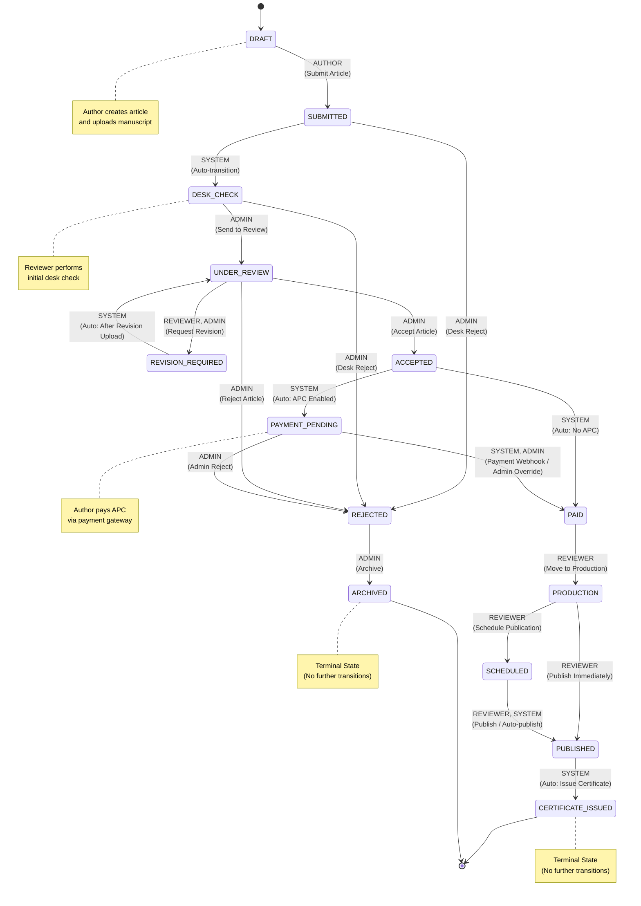
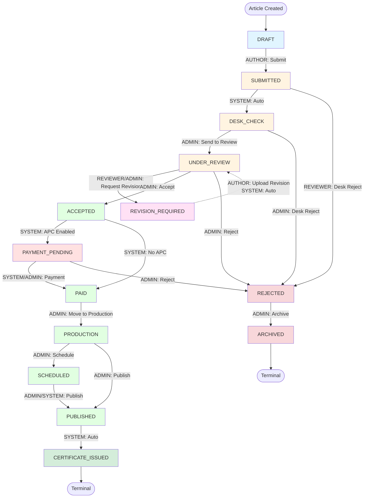

# Article Workflow - Role Mapping Diagram

## State Diagram View



## Flowchart View (Alternative)



## Role Legend

- **AUTHOR**: Can create articles, submit, and upload revisions
- **REVIEWER**: Can request revisions from UNDER_REVIEW status and submit review recommendations
- **ADMIN**: Editorial authority - can send to review, accept/reject articles, manage production, and publish
- **SYSTEM**: Automatic transitions handled by backend logic

## Key Workflow Paths

### Main Publication Path
```
DRAFT → SUBMITTED → DESK_CHECK → UNDER_REVIEW → ACCEPTED → 
PAYMENT_PENDING → PAID → PRODUCTION → PUBLISHED → CERTIFICATE_ISSUED
```

### Revision Path
```
UNDER_REVIEW → REVISION_REQUIRED → (upload_revision) → UNDER_REVIEW (automatic)
```

### Rejection Path
```
Any State → REJECTED → ARCHIVED
```

## Auto-Transitions (SYSTEM)

1. **SUBMITTED → DESK_CHECK**: Automatically transitions when author submits
2. **REVISION_REQUIRED → UNDER_REVIEW**: Automatically transitions after author uploads revision
3. **ACCEPTED → PAYMENT_PENDING/PAID**: Automatically transitions based on journal APC settings
4. **PUBLISHED → CERTIFICATE_ISSUED**: Automatically issues certificate after publication

